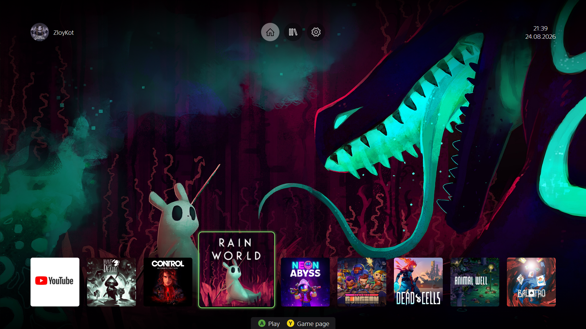
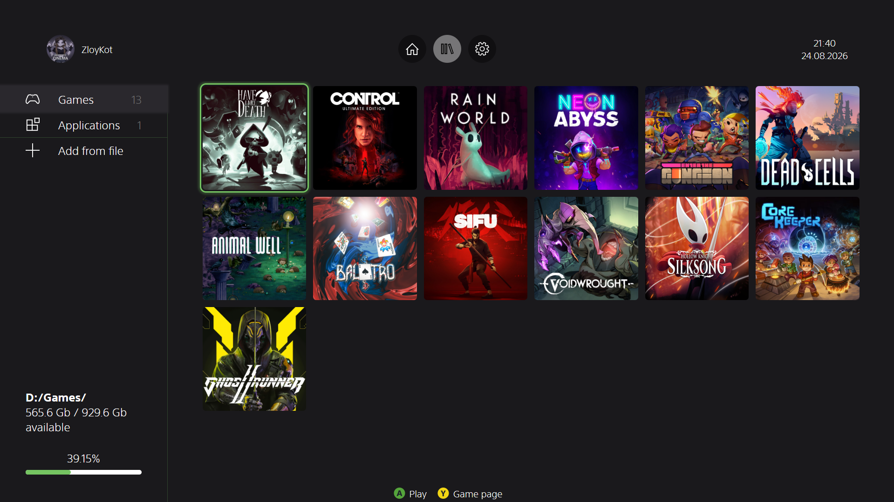

# XBOX-like game dashboard

## You probably don't need this thing. It is raw.
Only the most basic expected functions are implemented.  

* Import game from an .lnk file and fetch it's metadata from various sources
* Launch the game
* Some personalization options
* Gamepad support (recommended)

Game metadata and settings are stored in %AppData%/Local/com.zloykot.huinya as JSON files.

## I use [VacuumTube](https://github.com/shy1132/VacuumTube).  
You can download it and add this entry to your library.json:  
```json
{
    "id": 69,
    "title": "YouTube",
    "command": [
      "" // path to executable
    ],
    "img_square": "", // path to image
    "categories": [
      "Applications"
    ],
    "playtime": 0
}
```

## Installation
Required:
* Rust 1.94.0+
* Node 24.18.0+

First build the installer
```bash
git clone https://github.com/pr1nc3ofcats/dashboard
cd dashboard
npm install --legacy-peer-deps
npm run tauri build
```
And look for the installer in src-tauri/target/release/bundle/nsis

---

It only was tested on windows 10. Due to how inconsistently windows 10 and 11 handle encoding of data inside .lnk files i'm not sure about how it will behave on 11.  

Maybe bundled music is copyrighted.

## Screenshots


